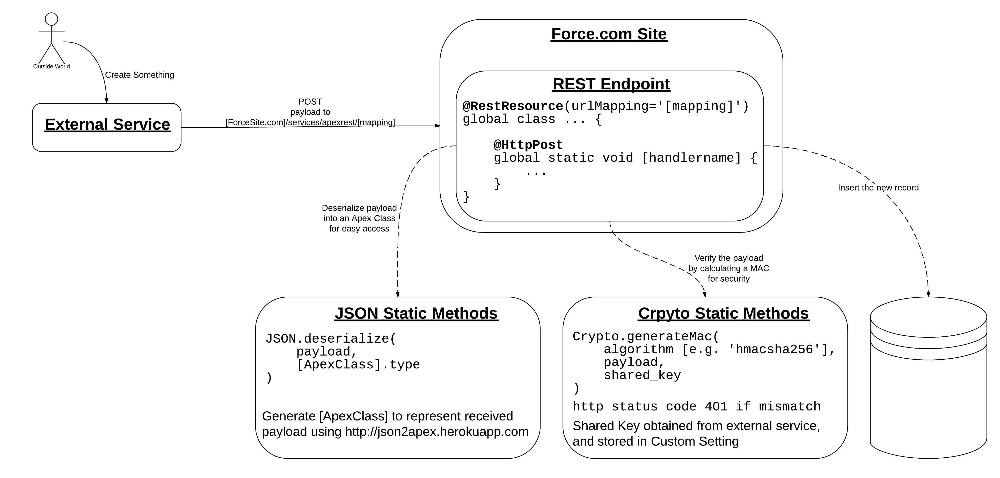

#Vertigo Consulting Group

This repo contains code used for live demo in the presentation "Integrating with Force.com using Webhook Handlers" presented at Dreamforce 2013 by Luke McFarlane & James Hill.

Demonstrates basic intregration with Chargify & JIRA via webhook handlers built using Apex REST in Force.com.

## The Entire Process

### In Picture Form

### In Words

_Note that this guide is not for a particular service, though does reference
some. If you have any problems, feel free to post an issue, or <a href="https://twitter.com/intent/tweet?screen_name=Oblongmana" class="twitter-mention-button" data-related="Oblongmana,lukem">ping James (Oblongmana) and Luke (lukemcf) on Twitter</a>)

#### Set up a Force.com Site

Follow the instructions at http://wiki.developerforce.com/page/An_Introduction_to_Force.com_Sites, customising as desired, until you reach "Assigning a Visualforce Page", at which point you should stop and ensure you have activated your Force.com Site.

#### Create and expose a basic anonymous endpoint

Create a new Apex Class for your resource, named `APIResource_[YourResourceName]`. For example, if we want an external service to be able to send JIRA Issues to us, we could call the class `APIResource_JIRAIssue`.

Copy the following stub class in, and note carefully the explanations in the comments

~~~ java
//Fill in the RestResource urlMapping with the desired path to your endpoint
// In this example, the endpoint will be 
//  https://[your-force-sitename].force.com/services/apexrest/path/to/endpoint
@RestResource(urlMapping='/path/to/endpoint/*') 
global class APIResource_YourResourceName {

    //When designing an API, a given endpoint can respond to these http 
    // request methods (there are others, which salesforce REST does not
    // support). They are indicated in Apex with the @Http[Method] 
    // annotation, where [Method] is one of the following.
    //  - DELETE    : used for deleting an item at the specified endpoint
    //  - POST      : used for creating a new item at the endpoint
    //  - PUT       : used to create OR modify an item (essentially upsert)        
    //  - PATCH     : modify an item
    //  - GET       : retrieve an item
    //
    //NOTE: There can only be one of each of these annotations per endpoint
    //
    //Here we're annotating our class as consuming HTTP POST requests,
    // indicating that we will create something in Salesforce from the 
    // payload sent.
    @HttpPost
    global static void postHandler() {
        //The RestRequest object contains useful information about the
        // request received from the outside world
        RestRequest req = RestContext.request;

        //The RestResponse object encapsulates your response to the outside
        // world. You don't need to explicitly return it, just modify it as
        // appropriate
        RestResponse res = RestContext.response;

        //As a general rule, if something unexpected could go wrong (which
        // can always happen), then you need to return an appropriate error
        // code. The catch-all returns a 500 error code; you should make
        // other branches that return more specific error codes
        try {
            //You would add your code here to consume the payload & do something
            // appropriate, like insert a new record (as would be expected for
            // and HTTP POST). You may want to leave it for now, and see further
            // notes in the README for more info on processing payloads
            res.statusCode = 200;
        }
        catch (Exception e) {
            //This is an internal server error code, indicating something went
            // wrong that probably wasn't the external party's fault
            res.statusCode = 500;
        }
    }
 
}
~~~

Now go back to your Force.com site setup in your browser, and add your new
APIResource class to the "Enabled Apex Class Access" in the 
"Public Access Settings".

At this stage, your endpoint has now been exposed to the public. When you send
an HTTP POST to the endpoint, you should receive an HTTP 200 status code back.
Try it out! You could do this using `curl` in the terminal, or perhaps
http://www.hurl.it/ instead. The endpoint should be 
https://[your-force-sitename].force.com/services/apexrest/path/to/endpoint
depending on what you've changed in your `@RestResource(urlMapping)`.

#### JSON Processing

Now you'll want to add some more sophisticated processing - at the moment we
only acknowledge that we've received the request.

If the external service you're integrating with sends JSON, their documentation
should include a sample of the post that they'll send to you. Here's a fictional example json object wrapping up info about a new Case:

~~~ json
{
    "id": "123",
    "summary": "This is a new issue",
    "description": "This is a long description of the new issue"
}
~~~

Now you could write a parser to handle the JSON token by token, but this is 
fairly risky. This is easy to break, and will consume a considerable number of
script statements towards the governor limits with more complex objects. Even
worse, it will take quite a while to write!

Instead, we're going to use the a Heroku app assembled by @metadaddy-sfdc and
@superfell - http://json2apex.herokuapp.com

Drop your sample JSON into the text panel, enter a name for the class (for 
example, you might call this class 'Issue'), leave "Create explicit parse code"
unchecked, and press create apex. In a few seconds, you'll be taken to a new
page containing an apex class for you to drop into your org (example below)

~~~ java
//
// Generated by JSON2Apex http://json2apex.herokuapp.com/
//

public class Issue {

    public String id;
    public String summary;
    public String description;

    
    public static Issue parse(String json) {
        return (Issue) System.JSON.deserialize(json, Issue.class);
    }
    
    static testMethod void testParse() {
        String json = '{'+
        '    \"id\": \"123\",'+
        '    \"summary\": \"This is a new issue\",'+
        '    \"description\": \"This is a long description of the new issue\"'+
        '}';
        Issue obj = parse(json);
        System.assert(obj != null);
    }
}
~~~

You'll see that this provides you with a strongly typed Apex representation of
of the JSON payload, as well as a `parse` method that takes a json string,
calling out to the Salesforce `JSON.deserialize` static method (only 1 script 
statement to parse the whole object!).

So, returning to your API Resource class, you can now drop some real processing
code into the try/catch block. The `RestRequest` object will generally contain
the JSON sent by the external service in the `requestBody` property, as a Blob.
Call `toString()` on it to get the JSON string, and you now have an Apex
representation of the received JSON to play with. If you examine the repo code
for JIRA Issues, you'll see we're creating new Cases from the payload, so we'll
do something similar here.

~~~ java
[...]
try {
    Issue receivedIssue = Issue.parse(req.requestBody.toString()); 

    Case newCase = new Case(
            Origin = 'Web - External Service',
            Status = 'New',
            Subject = receivedIssue.summary,
            Description = receivedIssue.description
        );
    insert newCase;

    res.statusCode = 200;
}
catch (Exception e) {

    res.statusCode = 500;
}
[...]
~~~

